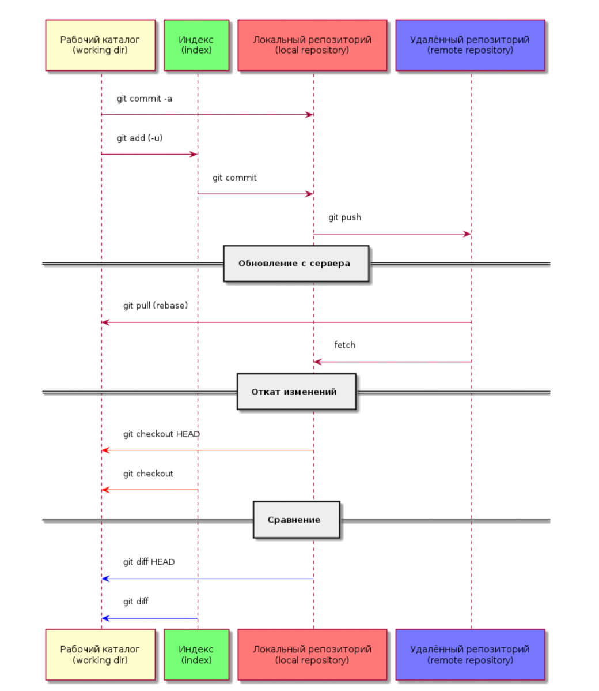

# Git Lesson

## Git commands

### Создание рабочей зоны

- `clone <url>`                                   клонировать удаленный репозиторий
- `init`                                          инициализировать репозиторий
### Работа с изменениями
- `add .`                                         добавить изменения в индекс
- `restore <file_name>|.`                         восстановить рабочее дерево (отменить в файле|все изменения)
- `commit -m "Info change"`                       записать изменения
- `rebase -i HEAD~<count_commit>`                 интерактивный режим для работы с коммитами
- `switch`                                        переключить ветку
- `branch -f <branch> <hash_commit>|HEAD~<count>` переместить ветку на коммит|относительно HEAD

### Просмотр истории и состояния
- `diff`                                          показать не зафиксированные изменения
- `log`                                           показать лог комитов
- `status`                                        показать статус состояния

### Работа с удаленными репозиториями
- `pull`                                          извлечь данные из удаленного репозитория и слияние
- `push`                                          отправка изменений в удаленный репозиторий

## Text formating

*course*

**bold**

__*course_bold*__

## Lists

- elem1
- elem2
* elem1
* elem2

1. elem1
3. elem2
2. elem1
    1. elem2

## Tables

| N   | Name   | Descriptions  |
|:---:|:-------|:--------------|
| 1.  | Apple  | fruit         |
| 2.  | Potato | the vegetable |        |
| n   | ...    | ...           |

## Pictures

## Urls

* [Official documentation git](https://git-scm.com/book/en/v2)
* [Interactive learn Git Branching](https://learngitbranching.js.org/?locale=ru_RU)

## Git commands GitHub
